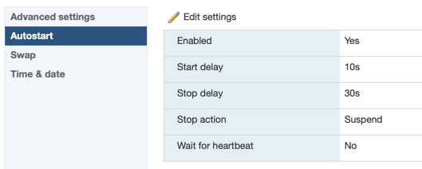
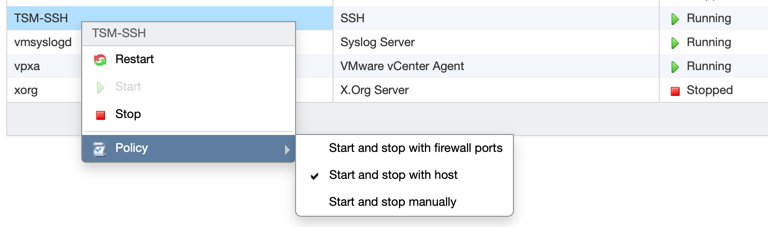

# Server UPS Supervisor

This project was made to safely power-off VMWare ESXi hosts on power loss which is detected on UPS using SNMP adapter.

## Supported hosts

| Host                        | Support |
|-----------------------------|---------|
| [VMWare ESXi](#vmware-esxi) | Yes     |
| Proxmox VE                  | Future  |
| Citrix XenServer            | Future? |

## Getting started

There are just few easy steps to start monitoring UPS and powering off your server

1. Clone repository using `git clone https://github.com/Z4NR34L-Software/server-ups-supervisor.git && cd server-ups-supervisor` in your terminal.
2. Edit UPS snmp information in `index.js` file.
```javascript
const session = adapter.createSession({
    address: "<YOUR_UPS_SNMP_ADDRESS>"
}, {
    verbose: true
})
```
3. Create new hosts file executing `cp hosts.json.example hosts.json` and change it to Your server ssh data.
4. Configure your hosts for permanent SSH access - [Go to hosts configuration section](#hosts-configuration).
5. Execute `npm install && npm run start` to install dependencies and run monitor.

## Hosts configuration

### VMWare ESXi

Presented version: `7.0U2a`

1. Open ESXi WebGUI in your browser and log in.
2. Navigate to `Host > Click "Actions" > Services > "Enable Secure Shell (SSH)"`.


3. Next you have to navigate to `Host > Manage > System > Autostart` and change settings as you have to, in my lab I've set like below


4. After that the last thing is setting SSH service to start with ESXi host.
   1. Go to `Host > Manage > Services`.
   2. Right-click on `TSM-SSH`.
   3. Change `Policy` to `Start and stop with host`.
   
5. You are ready to go ;)

Warning! ESXi root password is same for: ESXi GUI, ESXi Web Client, SSH 
